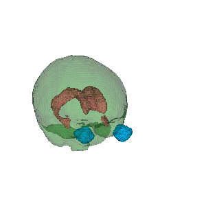
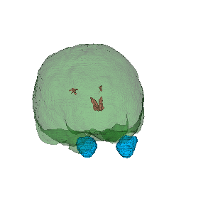

## Deep learning based brain extraction

This folder contains an implementation of DeepCTE3D, our lateral ventricles, brain and eyeballs 3D extraction algorithm based on deep learning using volumetric CT images of the head.
It can be used to pre-process CT images, train or adjust the network for extractions, or apply it to a data set using ours weights to perform masks extractions of the brain, lateral ventricles and eyeballs. If you use our model or weights, please cite.

Developed by [larissavm](https://github.com/larissavm).

## Prerequisites

- Python 3 with dependencies listed in the `requirements.txt` file
```
sudo pip install -r requirements.txt
```

## Results

The mean dice values of the generated masks (brain, lateral ventricles and background)  were calculated using the ground-truth masks as a reference. The initial values of the dice are calculated according to the equation: $Dice = \frac{2 |X∩Y|}{|X| + |Y| + s}$, and are calculated on the raw masks generated by the model, where they have not yet been binarized and resized to the original size. The initial mean Dice obtained was 98.35% for the mask of the brain, 89.23% for the mask of the lateral ventricles, and 92.20% for the mask of the eyeballs.

The masks generated by the model are not binarized, being considered as a probabilistic map. Therefore, it is necessary that these probabilistic maps undergo post-processing to obtain the final binarized masks of the structures of interest.

Various methods for performing post-processing were evaluated in order to obtain the binarized masks from the regions of interest. Due to some alterations present in CT images, such as the presence of a probe and calcifications, it was decided to use the background mask to generate the brain mask. We apply a threshold of 0.1 (sitk.BinaryThreshold) in the background mask and the largest connected component (sitk.ConnectedComponentImageFilter) is selected to detect it in the image. Having the background detected, the mask is inverted and the second largest connected component is selected, this being our region of interest, the brain mask. To finish the mask of the brain, a close operation (sitk.BinaryMorphologicalClosing) was performed with radius 1, in case there were small holes.

As for the post-processing of the lateral ventricles and eyeballs, it was necessary to apply thresholds (sitk.BinaryThreshold), 0.5 and 0.9, in their respective probabilistic maps. However, when resizing the mask of the lateral ventricles, there was a need to perform a dilation operation (SciPy library). 

After going through post processing, the masks were evaluated using the masks generated by the BET-FSL, Mevislab tools and a dependent operator flow as ground truth. Where brain masks were generated using the pipeline developed by [John Muschelli et. al. (2015)](https://www.ncbi.nlm.nih.gov/pmc/articles/PMC4446187/) and the mask of the lateral ventricles were generated by a [Mevislab workflow developed by us in a semi-automated way](https://dev.azure.com/proadiplataforma/MARIA%20II/_git/proadi.zika.models?path=%2Fmodels%2FSegmentacaoVentriculo), being operator dependent, and the masks of the eyeballs were generated following the [flow developed here](https://dev.azure.com/proadiplataforma/MARIA%20II/_git/proadi.zika.models?path=%2Fnotebooks%2Flarissa_sandbox%2Fextract_eyes.ipynb&version=GBdev). 

Validations of the post-processed masks were carried out on the 88 cases of the test set. We obtained as results for brain masks an median Dice coefficient of 98.12% with a standard deviation of ± 0.2% and a median of 98.48%; and an mean Jaccard coefficient of 96.38%, standard deviation of ± 3.3% and a median of 97.02%. For the lateral ventricle masks, we obtained an mean Dice coefficient of 80.76% with a standard deviation of ± 6.12% and a median of 81.29%; and mean Jaccard coefficient of 68.16%, standard deviation of ± 8.53% and median of 68.48%. Finally, for eyeball masks, we obtained an mean Dice coefficient of 86.74% with a standard deviation of ± 10.86% and a median of 89.55%; and mean Jaccard coefficient of 77.63%, standard deviation of ± 11.28% and median of 81.08%. The results can be seen in the boxplots represented below.

|             Brain mask boxplot              |               Ventricles mask boxplot                |             Eyeballs mask boxplot              |
| :-----------------------------------------: | :--------------------------------------------------: | :--------------------------------------------: |
|  |  |   |

Below we present 2 examples of results from the test set, where the masks generated by our model (DeepCTE3D) overlap and in the same color contour we have the groun-truth masks. We also have the 3D visualization of the masks generated by our model.

|           DeepCTE3D 2D masks           |     Contour ground-truth 2D masks      |           DeepCTE3D 3D masks            |
| :------------------------------------: | :------------------------------------: | :-------------------------------------: |
|    |    |   |
|    |    |   |

## Usage

### Preprocessing

Note: Data pre-processing is performed during the function to generate the mask.

#### The filters used to select which series can be segmented

The first step is list all folders of the directory passed like parameter to the function findVolumeIterest. The array of folders found must be scanned to verify if it is dicom series.


### Generating masks
To generate the masks it is necessary to set some variables, either in the json file or by informing arguments when running the code. If you choose to change in [json](main/model/src/config/config.json) the several to be changed are: 

- `model_weights`     - path to the trained weights
- `image_size`        - model input dimensions
- `input_path`        - folder that contains the NIfTIs files to be used to generate the masks, or NIfTI file name, or DICOM folder name
- `output_path`       - folder where the generated masks will be saved 
- `number_class`      - number of classes
- `classes_names`     - class-named list

The masks will be saved with the same name as the input file and with the suffix "_brain_mask", "_ventricle_mask" and "_eye_mask" and in the folder specified by the variable `output_path`, in case the folder doesn't exist it'll be created.

When variables are set, run the masks generation using:
```
python src/create_masks.py
```

If you choose to change via argument, run the masks generation using:
```
python src/create_masks.py -i ./data/generate/ -w ./results/weights.h5 -o ./results/tests/
```
Where `-i` or `--input` is given the input or file path; `-o` or `--outpath` is the folder in which the generated masks will be saved; and `-w` or `--weights` is the path to the .h5 file with the weights in the model.


